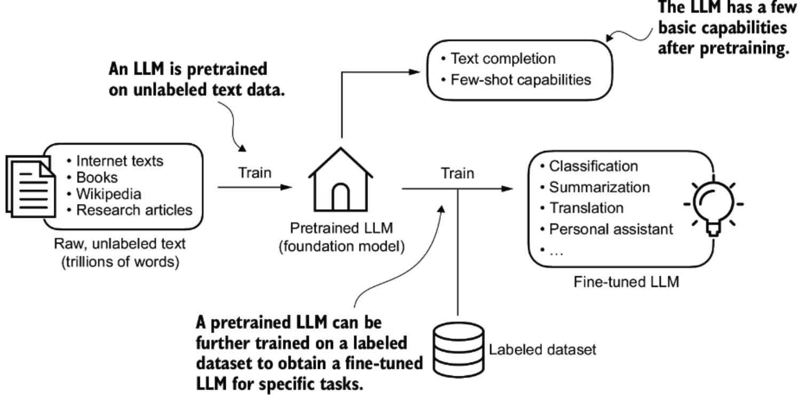
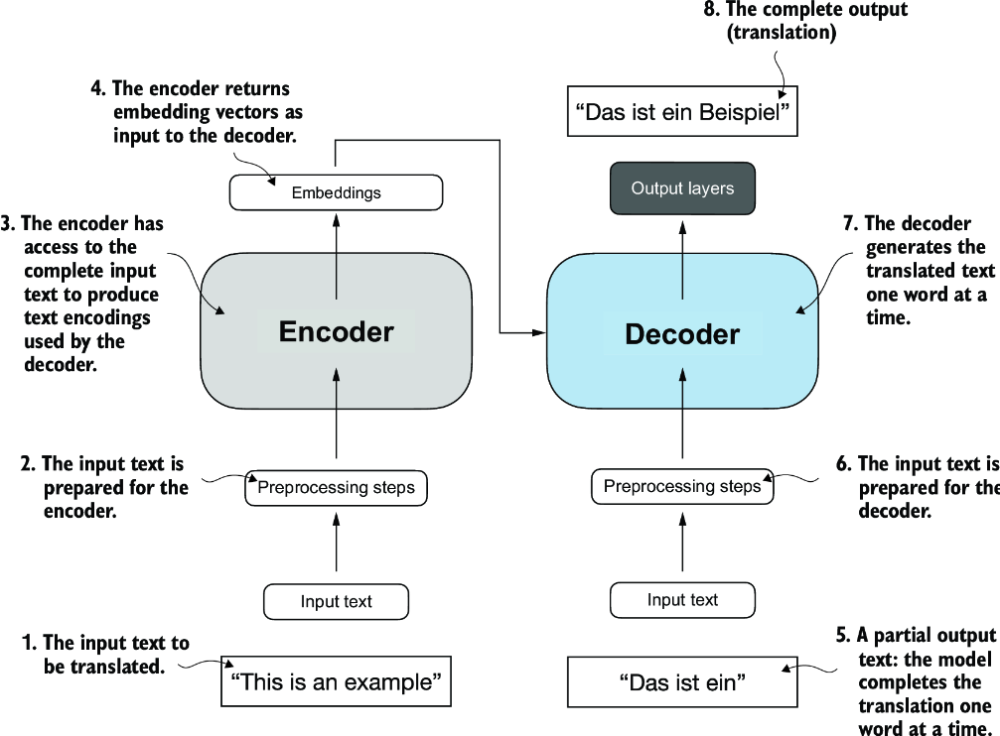
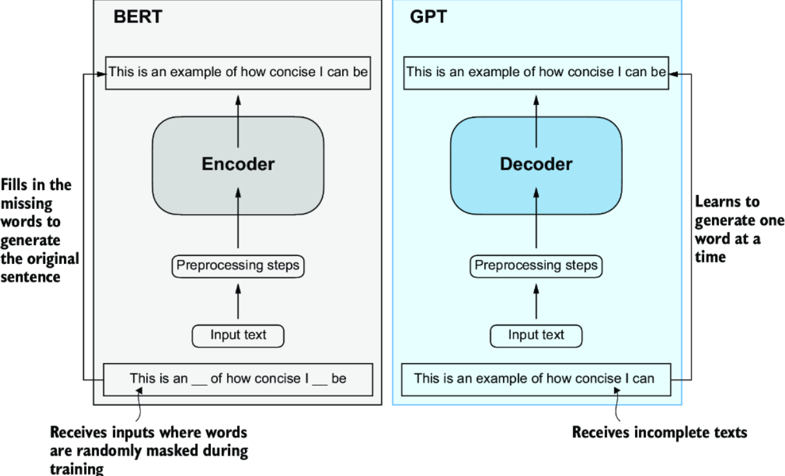
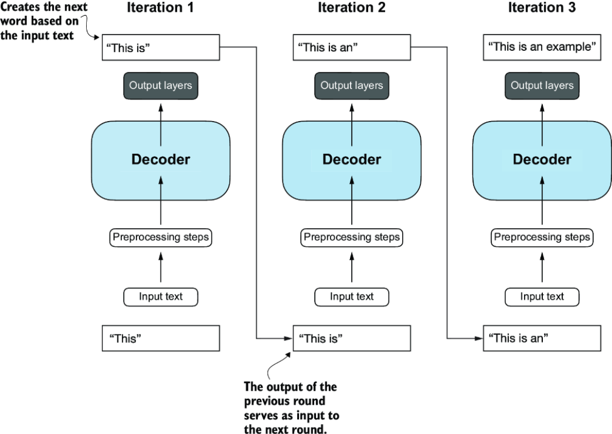

*Pretraining an LLM*

The "pre" in "pretraining" refers to the initial phase where a model is trained on a large, diverse dataset to develop a broad understanding of language. This is followed by "fine-tuning" on a smaller, task-specific dataset to specialize the model for a particular task. The result of the pretraining phase creates an initial *pretrained LLM*, also often called as *base* or *foundation model*. The two most popular categories of fine-tuning LLMs are *instruction fine-tuning* and *classification fine-tuning*.

---

*Simplified depiction of transformer architecture*

Transformer architecture consists of two submodules: the *encoder* and the *decoder*. The encoder processes the input text and encodes it into vectors that capture the contextual information of the input. Then, the decoder takes these encoded vectores and generates the output text. 

Key component in the transformer architecture is the *self-attention mechanism*. It allows the model weigh the importance of different words/tokens in a sequence relative to each other.

---

*Transformer's encoder and decoder submodules*

BERT is built upon the transformer's encoder submodule. It is specialized in masked word prediction tasks (model predicts masked/hidden words in a given sentence). BERT also excels in classification tasks, such as sentiment analysis and document categorization.

GPT focuses on the decoder submodule of the transformer architecture. It is designed to fpr tasks that require generating text, such as language translation, text summarization, and question answering.

The next-word prediction task is a form of self-supervised learning, which is a form of self-labeling. This means we can use the next word in a sentence as the label that the model is supposed to predict. This makes it possible to use massive unlabeled text datasets to train LLMs.

---

*decoder-only architecture of GPT is designed for unidirectional, left-to-right processing*

The general GPT architecture is just the decoder part without the encoder. Decoder-style models generate text by predicting one word at a time. Hence, they are considered a type of *autoregressive* model. Autoregressive models incorporate their previous outputs as inputs for future predictions.

GPT-3 architecture is significantly larger than the original transformer model. The original transformer repeated the encoder-decoder blocks 6 times. GPT-3, on the other hand, uses 96 encoder-decoder blocks and has 175 billion parameters in total.

# Summary
- Modern LLMs are trained in two main steps:
    - First, they are pretrained on a large corpus of unlabeled text by using the prediction of the next word in a sentence as a label.
    - Then, they are fine-tuned on a smaller, labeled target dataset to follow instructions or perform classification tasks.
- LLMs are based on the **transformer** architecture. The key idea of the transformer architecture is an *attention* mechanism that gives the LLM selective access to the whole input sequence when generating the output one word at a time.
- The original transformer architecture consists of an **encoder** for parsing text and a **decoder** for generating text.
- LLMs for generating text and following instructions, such as GPT-3 and ChatGPT, only implement decoder modules, simplifying the architecture.
- Large datasets consisting of billions of words are essential for pretraining LLMs.
- While the general pretraining task for GPT-like models is to predict the next word in a sentence, these LLMs exhibit emergent properties, such as capabilities to classify, translate, or summarize texts.
- Once an LLM is pretrained, the resulting foundation model can be fine-tuned more efficiently for various downstream tasks.
- LLMs fine-tuned on custom datasets can outperform general LLMs on specific tasks.