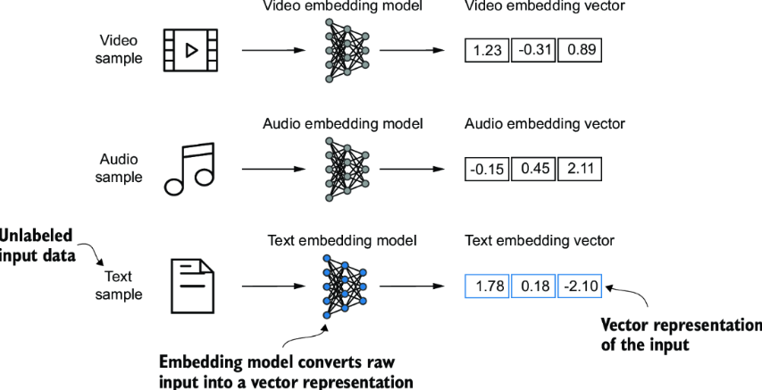
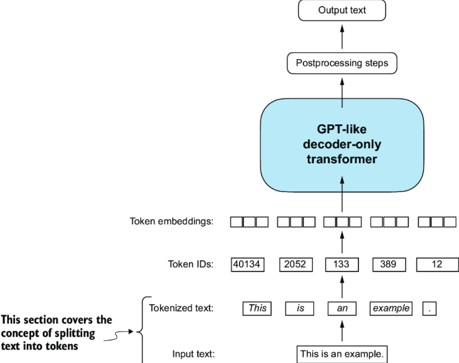

LLMs can't process raw text data. They need to be converted into continuous-valued vectors. The concept of converting data into a vector format is often referred to as *embedding*.

An embedding is a mapping from discrete objects, such as words and images, to points in a continuous vector space. While word embeddings are the most common form of text embedding, there are also embeddings for sentences, paragraphs, and entire documents. Sentence or paragraph embeddings are popular choices for RAG. The focus in this book is on **word embeddings**.

One of earlier and popular word embeddings is **Word2Vec**. Main idea behind Word2Vec is that words that appear in similar contexts tend to have similar meanings. When projected into 2D space, words with similar meanings are close to each other.

LLMs commonly produce their own embeddings that are part of the input layer and are updated during training.

Word embeddings can have varying dimensions. A higher dimensionality might capture more nuanced relationships but at the cost of computational efficiency.

For LLMs, higher-dimensional embeddings are more common. For example, GPT-2 models use an embedding size of 768, while GPT-3 model (175B parameters) uses an embedding size of 12,288.

## Tokenizing text

