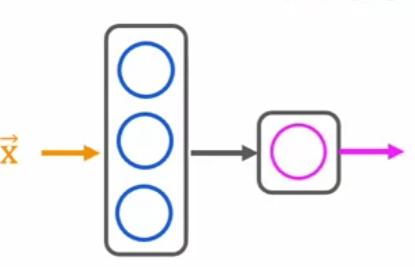
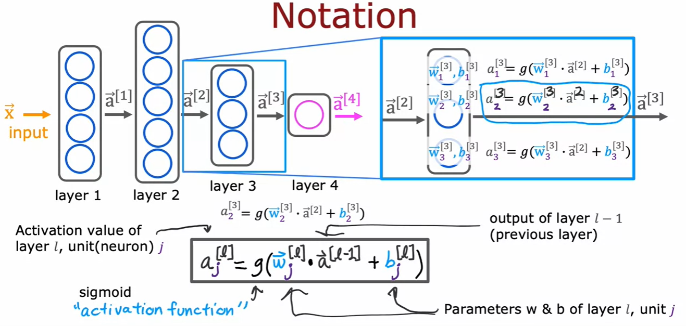

# Neural Networks

## Intuition
The original motivation when neural networks were first invented was to write a software than can mimic how the human brain works.

in a nutshell: neuron takes in a bunch of inputs (numbers) and then outputs some other numbers.

Why neural networks bloomed in the last couple of decades eventhoughh they were invented in the 50s? The explosion of data and computing power.

"activations are higher level features"

## Neural Network Model

Suppose a demand prediction task where we want to predict the demand for a particular shirt product based on various factors such as color, cotton material, price, and seasonality.

Suppose a neural network that has 3 layers:
- an input layer
- a hidden layer
- an output layer



Suppose we have 4 input features


zoom in on the hidden layer:
This hidden layer inputs four numbers and these four numbers are inputs to each of three neurons. Each of these three neurons is just implementing a little logistic regression unit or a little bit logistic regression function.

.




.
```
By convention, input layer is also called as the 0th layer. So, a neural network with 4 layers is a neural network with 3 hidden layers and 1 output layer.
```

The process of moving through activation layers from input to output is called **forward propagation**. Likewise, there is also backward propagation (moving from output to input), which is used for learning.
.

.

> check out: 
```
1. https://github.com/pmulard/machine-learning-specialization-andrew-ng
2. https://github.com/Param302/ML-specialization-notes/tree/master/Course%202%20-%20Advanced%20Learning%20Algorithms 
```

.

.

.

.

.

.

.

.

.

.

.


---
---
---
A neural network consists of layers of interconnected nodes or "neurons":

    Input Layer: Receives the initial data
    Hidden Layer(s): Processes the information
    Output Layer: Produces the final result

Each neuron receives inputs, processes them, and passes the result forward
Connections between neurons have weights, determining signal strength

Activation Function: 

    Applied after a neuron receives inputs.
    Introduces non-linearity, allowing learning of complex patterns
    Common functions: ReLU, sigmoid, tanh

Forward Propagation

    Data enters the input layer.
    Each neuron in the next layer computes a weighted sum of its inputs
    Sum is passed through an activation function
    Process repeats through all layers until output is produced

Loss Function

    Measures network performance
    Quantifies difference between prediction and actual target value

Backpropagation

    Calculate gradient of loss function with respect to each weight.
    Determine each weight's contribution to the error
    Adjust weights to minimize loss

Gradient Descent

    Optimization algorithm for updating weights:
        Move weights in direction that reduces loss
        Learning rate determines step size

Training Process

    Feed training data batch through network (forward propagation)
    Compute loss
    Use backpropagation to calculate gradients
    Update weights using gradient descent
    Repeat with new batches until performance is satisfactory

Hyperparameters

    Number of layers and neurons
    Learning rate
    Batch size
    Number of training epochs


---